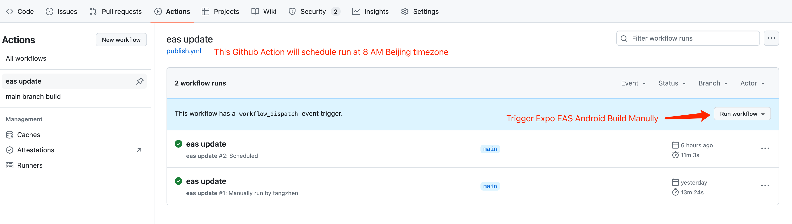
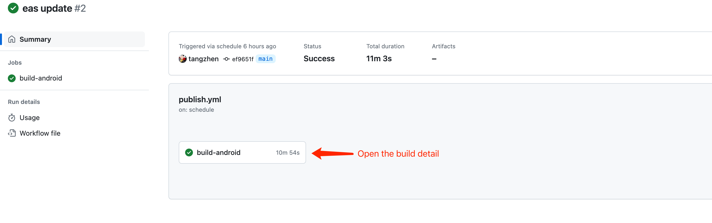
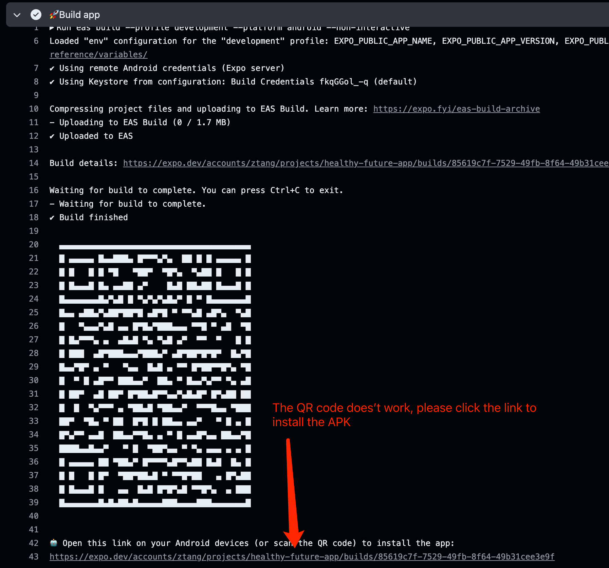

# Publish Guide

This guide outlines the process for building and publishing the app using Expo and GitHub Actions.

## 1. Overview

Our app is built and published using Expo, with the build process triggered by GitHub Actions. The build can be triggered manually or automatically at 8:00 AM Beijing Time every day.

### Key Points:
- **Manual Trigger**: You can manually trigger a build at any time.
- **Automatic Build**: A build is automatically triggered every day at 8:00 AM Beijing Time.
- **Build Failure**: If the build fails, please check whether the Expo build usage limits have been exceeded.

## 2. Triggering a Build

### Manually Triggering a Build

To manually trigger a build, follow these steps:

1. Navigate to the GitHub repository for the project.
2. Go to the "Actions" tab.
3. Select the workflow related to the build process.
4. Click on the "Run workflow" button to start the build manually.

### Automatic Build Schedule

The build is scheduled to run automatically every day at 8:00 AM Beijing Time. This ensures that the latest updates are regularly built and available for testing or production.

## 3. Monitoring the Build Process

After the build has been triggered, you can monitor its progress in GitHub Actions. The build details, including logs and the status, will be displayed in the workflow run.

## 4. Handling Build Failures

If the build fails, it could be due to various reasons, such as:

- **Expo Build Limits**: Expo imposes usage limits on builds. If the build fails, check if the limits have been reached.
- **Code Issues**: Errors in the code may also cause the build to fail.

To check Expo's build usage and limits, visit the [Expo Build Dashboard](https://expo.dev).

Make sure to monitor the build logs and address any issues promptly to ensure successful builds.

## 5. Conclusion

Following this guide will help ensure that the app is built and published correctly. If you encounter any issues or have questions, please reach out to the development team for assistance.
